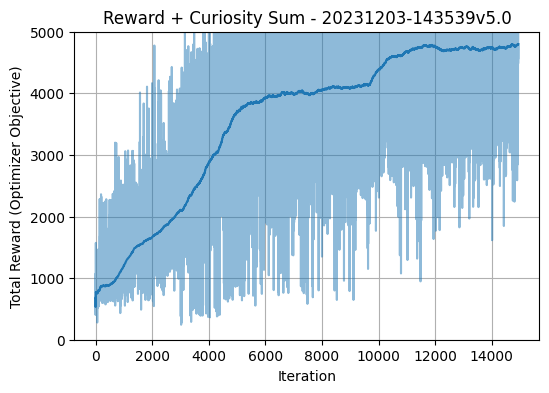

# PPO with curiosity learning

This repository contains rought and low level implementaion of PPO with curiosity learning. This repo is code for paper I wrote recently . The study focuses on comparing various methods and techniques for training agents in diverse environments, encompassing the need for temporal information, exploration through curiosity and interactions between multiple agents in self-play

## MsPacman model sample

It is easly able to achive score `>3000` in pacman. In comparsion with DQN I was able to achive at most 700 points on avg. In some experiments I had to cap amount of points given to agent for capturing ghosts becouse actor focues too much on capcures instead of exploring map (Capture reward decreses from 1000 to 100). It made actor act a bit more like human would.

To reproduce effects run appropriate train script (`src/train_*.pl`). Hyperparameters were changed during training. For exac values, plese refer to linked paper.   

RL requires a lot of tuning even tho PPO is quite robust on its own. PPO has tendency to settle in local minimas and have hard time finding new strateges without addinational techniques (it has online policy, so it uses same sampling function for running and training). Curiosity encourages agents to explore more and to take paths that are considered suboptimal by policy, but might result in better overall performance. With that in place ppo is able to quicly learn complex enviroments. 

This implementaion uses `@tf.function` whenever possible so it also runs quite fast. 
## Critic loss and Avg Score
Loss of the critic in PPO model is shown on plot below. Algorithm pritty quicly gets big rewards and critic had hard time predicting them, after awhile it settled down and ciritic learn how actor and env behaves and was able to estimate rewards 

## Curiosity rewards
Curiosity coef were changing during training.

## Opt Objective (Reward + Curiosity Reward)
Optimalization objective is sum of reward and curiosity rewards. 

